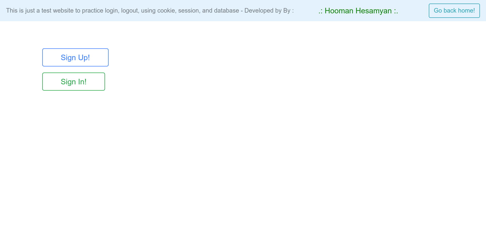

# register-login-express
Register a user then login using cookie, session, and database.

[Website](https://register-login-express.herokuapp.com/)

---

## Screnshots




---

Load `.env` file:
```
export $(grep -v '^#' .env | xargs)
```

